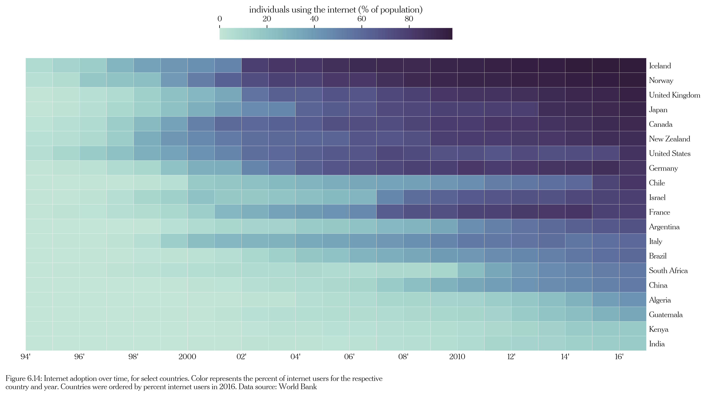
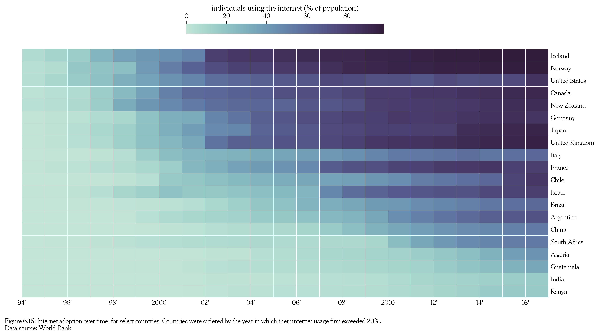
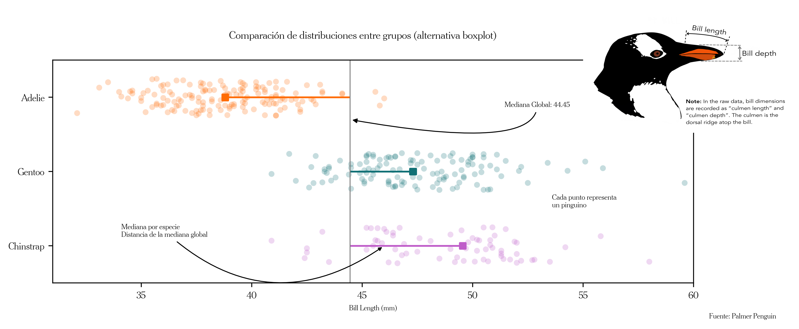
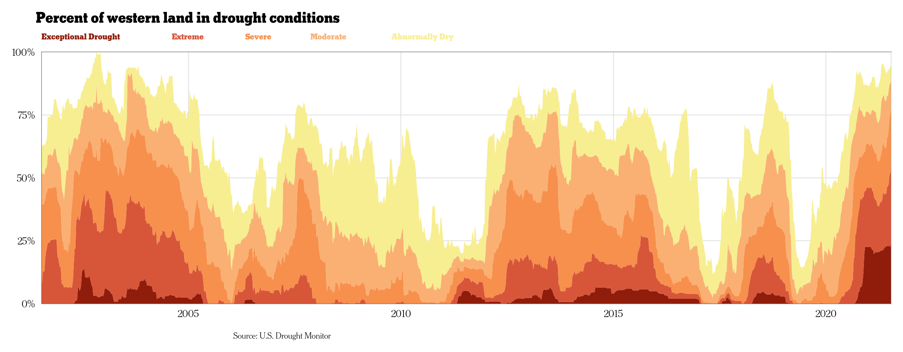

<h1 align="center">
  &nbsp;Women in Data: Guatemala Chapter  Visualización de datos con Python&nbsp;
</h1>

----

Material de mi presentación en Women in Data: Guatemala Chapter realizada el 13/10/2021.

Notebook en Google Colab con la implementación en python 🐍 de las visualizaciones
de la presentación y material adicional. Para verlo solo debes hacer clic en el banner de abajo "*Open in Colab*":

Slides de la presentación [aquí](https://github.com/alcazar90/WomenInData-Guatemala2021/blob/master/data-viz-women-in-data-guatemala%20chapter-13102021.pdf).

Video de la presentación [aquí](https://m.facebook.com/events/561555721835584/).

Comentarios o preguntas [aquí](https://github.com/alcazar90/WomenInData-Guatemala2021/issues/1).

Acerca de la presentación:

> El objetivo de la presentación fue exponer ideas y conceptos sobre la visualización de datos que las y los nuevos practicantes deben dominar en su transición a usuarios más avanzados. Conceptos como los de diseñar una visualización por capas, identificar el rol de las anotaciones como un elemento esencial para facilitar la lectura de la visualización a la audiencia, y la adopción de buenas prácticas para evitar errores comunes.

## Visualizaciones

Haz clic para expandir y ver algunas de las principales visualizaciones expuestas
en la presentación. El código para cada una de las visualizaciones se encuentra en el notebook.

  
 Parte 1: mapa de calor y cantidades en el tiempo

  

  

  
 Parte 2: creando una visualización por capas

  

  
 Parte 3: la sequía y los colores

  

## Recursos utilizados en la presentación:

1. [Fundamentals of Data Visualization - Claus O. Wilke (2019)](https://clauswilke.com/dataviz/)

2. [The Evolution of a ggplot (Ep. 1) (Cédric Scherer)](https://www.cedricscherer.com/2019/05/17/the-evolution-of-a-ggplot-ep.-1/): la parte 2 de la presentación
se basa en este *post*

3. [Colors and Emotions in Data Visualization (Cédric Scherer)](https://www.cedricscherer.com/2021/06/08/colors-and-emotions-in-data-visualization/)

4. [The Python Graph Gallery](https://www.python-graph-gallery.com)

   - Se muestra como ejemplo la visualización que aparece en el *post* ["Palmer Penguins exploration with violinplots in Matplotlib"](https://www.python-graph-gallery.com/web-ggbetweenstats-with-matplotlib)

5. Artículos públicados por *The New York Times* mencionados en la presentación:

   - Se utiliza como ejemplo el barplot públicado en ["How Other Nations Pay for Child Care. The U.S. Is an Outlier" (The New York Times)](https://www.nytimes.com/2021/10/06/upshot/child-care-biden.html?smtyp=cur&smid=tw-nytimes)

   - Se muestra y reproduce el *stacked area chart* en python 🐍  públicado en ["How Severe Is the Western Drought? See For Yourself" (The New York Times)](https://www.nytimes.com/interactive/2021/06/11/climate/california-western-drought-map.html)

6. [Off the Charts: How we use colour in our chart design (*The Economist newsletter* del equipo de visualización)](https://view.e.economist.com/?qs=e2eb491699083554e6e0165e2847c6ebb1f8701f81f48a77a213f54bb25691d58948226f18f5041b191897ec7e98e6462192c63afffc8fcb27220927072403ebf4a1d8b65776755bcddddcf91218183a). En la presentación hay 3 visualizaciones de ejemplos mencionados en esta edición del _newsletter_

